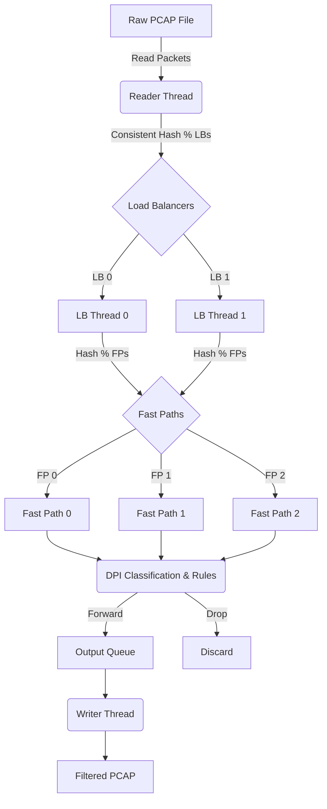

<div align="center">

# DPI Engine - Deep Packet Inspection System

**A high-throughput C++17 packet analyzer that reconstructs TCP/UDP flows and classifies traffic via TLS SNI & HTTP Host inspection**

[](https://isocpp.org/)
[](https://www.tcpdump.org/)
[](#architecture)

</div>

---

## Overview

A high-performance Deep Packet Inspection (DPI) engine written in modern C++17. The system ingests raw PCAP network captures, parses Ethernet, IPv4, TCP, and UDP headers to reconstruct stateful network flows (5-tuple), and performs application-layer protocol inspection. 

By analyzing the TLS Client Hello handshake (SNI extraction) and HTTP Host headers, the engine can accurately classify encrypted HTTPS traffic and selectively enforce firewall rules (Drop/Forward) based on Application Type, Domain Name, or Source IP. 

Designed for high throughput, the system features a multi-threaded Load Balancer and Fast Path architecture utilizing consistent hashing to distribute flow processing across multiple worker threads while maintaining TCP state.

---

## Key Features

- **Protocol Parsing:** Zero-copy parsing of L2/L3/L4 headers (Ethernet, IPv4, TCP, UDP).
- **TLS SNI Extraction:** Deep inspection of TLS 1.2/1.3 handshakes to extract Server Name Indication (SNI) for encrypted traffic classification.
- **Stateful Flow Tracking:** Hash-based connection tracking using standard 5-tuples (Src IP, Dst IP, Src Port, Dst Port, Protocol).
- **Rule-based Firewall:** Configurable blocking engine (Drop/Forward) with support for IP, Domain, and Application-level rules.
- **Multi-threaded Architecture:** 
  - **Load Balancers:** Distribute incoming packets to Fast Paths.
  - **Fast Paths:** Parallel flow processing using consistent hashing to ensure packets from the same connection hit the same thread.
  - **Thread-safe Queues:** Lock-based producer-consumer queues with condition variables for efficient dispatching.

---

## Architecture

The system achieves parallelism by decoupling packet I/O from flow processing:



*Consistent hashing ensures that all packets belonging to the same TCP connection are processed by the same Fast Path thread, preventing state corruption without expensive per-flow mutex locks.*

---

## Tech Stack

- **Language:** C++17
- **Networking:** libpcap
- **Concurrency:** `<thread>`, `<mutex>`, `<condition_variable>`
- **Build System:** CMake (3.16+)

---

## Project Structure

```
DPI-Engine/
├── include/                    # Header definitions
│   ├── pcap_reader.h           # PCAP file parsing
│   ├── packet_parser.h         # L2/L3/L4 protocol parsing
│   ├── sni_extractor.h         # TLS/HTTP L7 inspection
│   └── types.h                 # FiveTuple, Flow states
├── src/                        # Implementations
│   ├── pcap_reader.cpp         
│   ├── packet_parser.cpp       
│   ├── sni_extractor.cpp       
│   ├── dpi_mt.cpp              # Multi-threaded production engine
│   └── main_working.cpp        # Single-threaded reference engine
├── generate_test_pcap.py       # PCAP generation utility for testing
└── CMakeLists.txt              # CMake configuration
```

---

## Setup and Installation

### Prerequisites
- C++17 compatible compiler (`g++` or `clang++`)
- CMake 3.16+

### Build

```bash
git clone https://github.com/Shashank17singh/DPI-Engine.git
cd DPI-Engine

cmake -B build -DCMAKE_BUILD_TYPE=Release
cmake --build build
```

This compiles both the high-performance multi-threaded binary (`dpi_engine`) and the reference single-threaded binary (`dpi_simple`).

---

## Usage

Run the engine against a PCAP file. By default, it will parse, classify, and output a filtered PCAP.

```bash
./build/dpi_engine input.pcap output.pcap
```

### Firewall Rules

You can inject blocking rules via CLI arguments:

```bash
./build/dpi_engine input.pcap output.pcap \
    --block-app YouTube \
    --block-app TikTok \
    --block-ip 192.168.1.50 \
    --block-domain facebook
```

### Thread Configuration

Tune the number of Load Balancers (LBs) and Fast Paths (FPs) for your hardware:

```bash
# Creates 4 Load Balancers and 8 Fast Paths (32 processing threads total)
./build/dpi_engine input.pcap output.pcap --lbs 4 --fps 8
```

---

## License

This project is licensed under the [MIT License](LICENSE).
